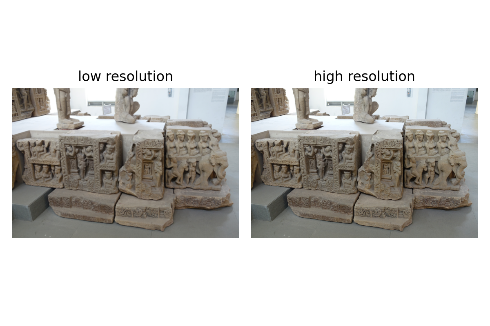
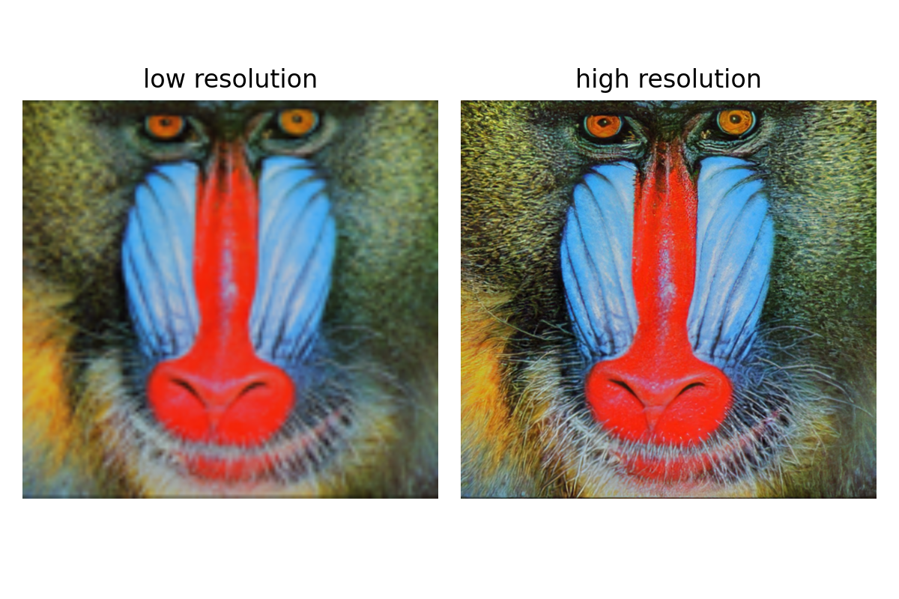
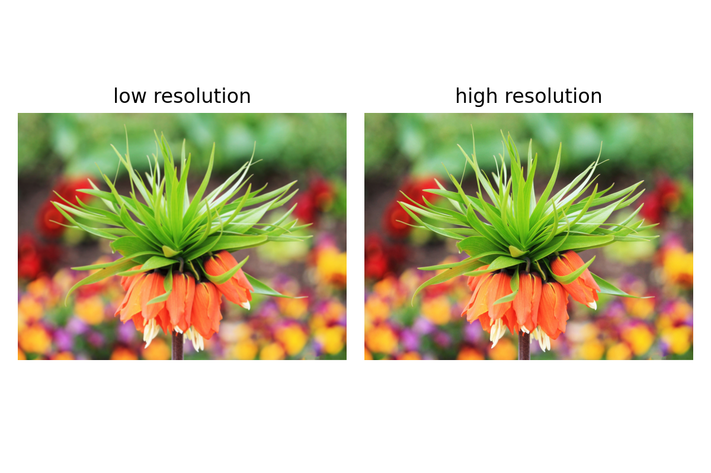
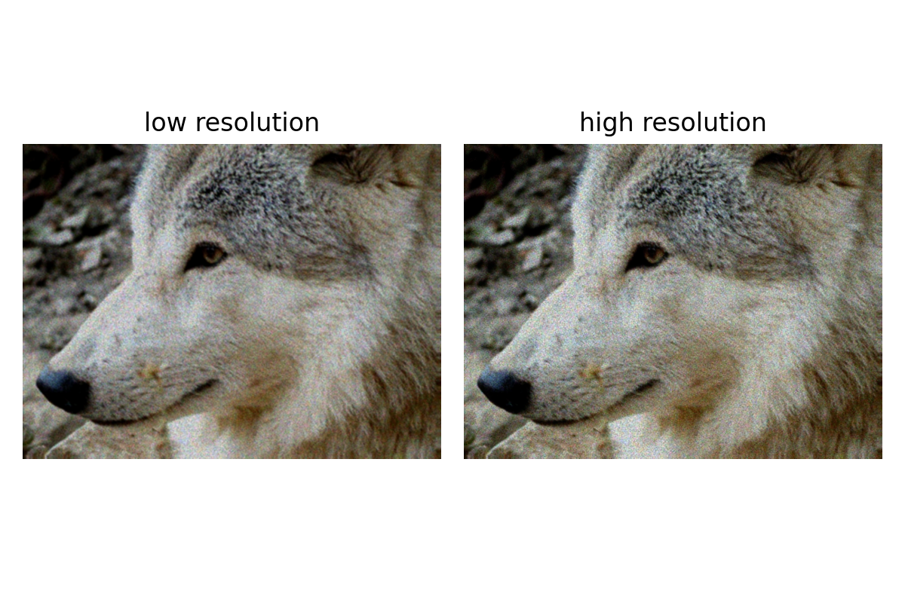

# Week7 (super resolution)

* res1: 



* res2:



* res3:



* res4:



## Installation

Basic Environment Requirements:

* pytorch >= 1.3;
* related cudatoolkit & cudnn packages;

```bash
git clone https://github.com/open-mmlab/mmediting.git
cd mmediting
pip install -r requirements.txt
pip install -v -e .
./inference_prepare.sh
```

## Usage

```bash
python inference.py esrgan_config.py esrgan.pth [input_image_path] [output_image_path]
# demo command
python inference.py esrgan_config.py esrgan.pth imgs/a_lr.png demo.png
```
