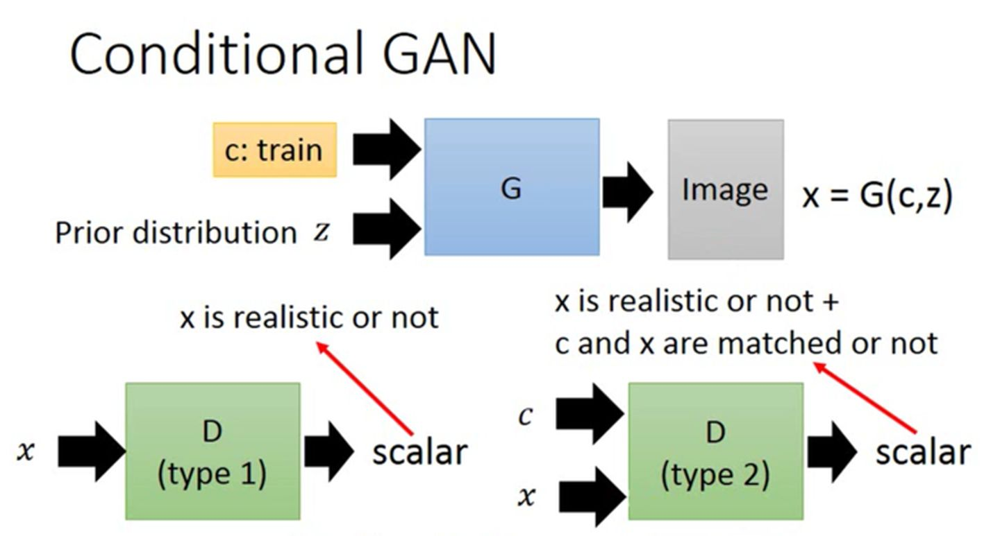
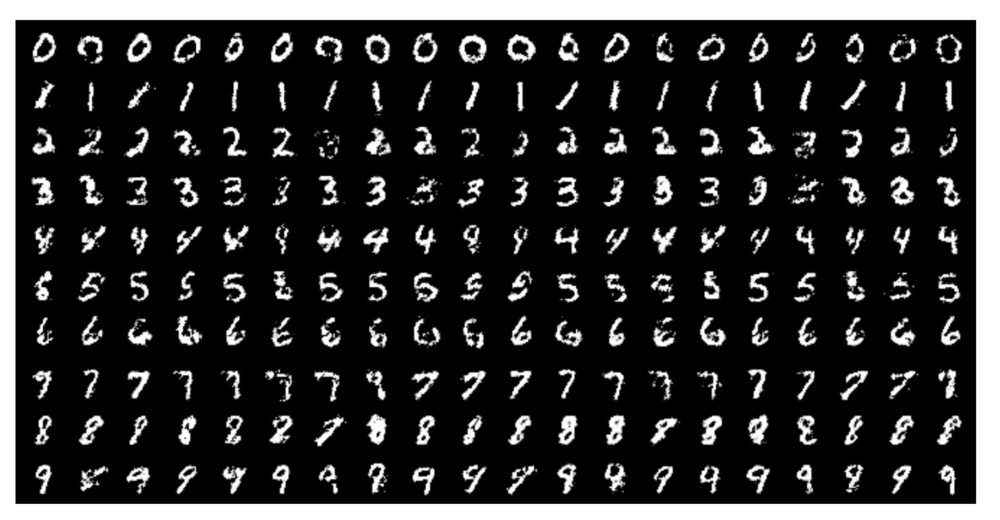
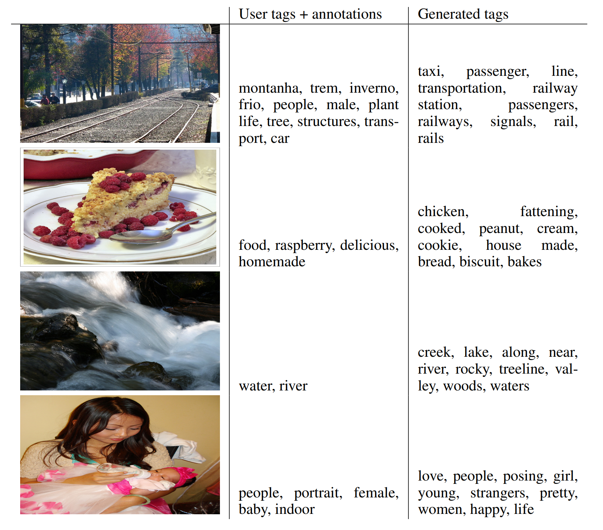
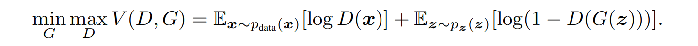
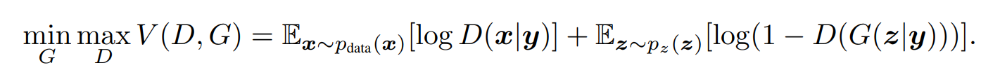
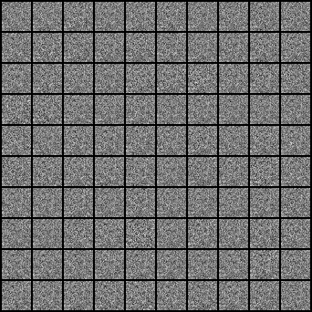

# Conditional GAN

Title: Conditional Generative Adversarial Nets
Url: https://arxiv.org/pdf/1411.1784.pdf

## Conclusion

1. **是什么?** 这篇文章是基于 GAN 模型的增量式改动, Conditional GAN 可以被归纳为: 通过输入一些先验信息来控制 GAN 的生成器和判别器来进行条件式生成;

图 1. Conditional GAN 的方法结构

2. 为什么? 使用 GAN 这一生成模型会随机生成类似于训练集的图像, 然而当在条件受限情况下生成图像图像时, GAN 就无法完成这一操作, 于是通过在训练的时候带入条件信息来进行训练, 就能够让模型根据条件信息来生成特定的图像, 例如, 对 Mnist 数据集只生成 ‘1’ 的图像, Conditonal GAN 就能够实现;

图 2. Mnist 数字图像按照给定类别进行生成

图 3. 图像标签根据用户输入的提示生成

3. 怎么做? 其实 Conditional GAN 的实现方式比较简单, 只需要通过将对抗 loss 的概率都调整为条件概率即可 (x 为判别器输出, z 为扰动噪声, y 为条件先验):

## Results

